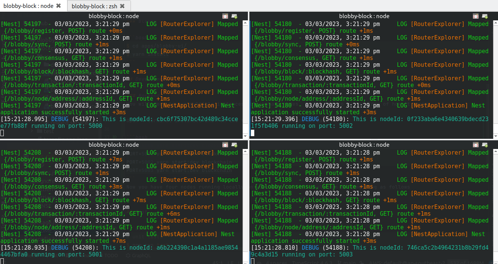

<p align="center">
  
</p>

## Description

Blobby Block is a simple blockchain that works pretty much like bitcoin and is to be used for educational purposes.
The backend is in [apps/blockchain](./apps/blockchain)
And the front end block explorer is at [apps/blobby-ui](./apps/blobby-ui)

## Requirements
* [node](https://nodejs.org/en/download/) `^14.15.0 || ^16.10.0 || >=18.0.0`


## Installation

### Blobby Block 

```bash
$ yarn install
```

### Blobby UI

```bash
$ cd apps/blobby-ui/
$ yarn install
```

## Development

### Backend
You will need to run multiple instances _blockchain nodes_ to be able to get an idea of how it works

Open 4 terminal instances and run the following one command in each

```bash
PORT=5000 yarn start:dev blockchain
PORT=5001 yarn start:dev blockchain
PORT=5002 yarn start:dev blockchain
PORT=5003 yarn start:dev blockchain
```
Now you have four nodes running locally on your machine the result can be something as follows



## Test

```bash
# unit tests
$ npm run test

# e2e tests
$ npm run test:e2e

# test coverage
$ npm run test:cov
```

## Support

Nest is an MIT-licensed open source project. It can grow thanks to the sponsors and support by the amazing backers. If you'd like to join them, please [read more here](https://docs.nestjs.com/support).

## Stay in touch

- Author - [Kamil Myśliwiec](https://kamilmysliwiec.com)
- Website - [https://nestjs.com](https://nestjs.com/)
- Twitter - [@nestframework](https://twitter.com/nestframework)

## License

Nest is [MIT licensed](LICENSE).
