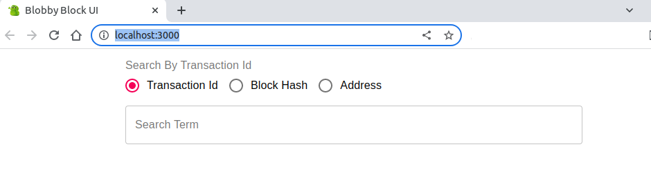

<p align="center">
  
</p>

## Description

Blobby Block is a simple blockchain that works pretty much like bitcoin and is to be used for educational purposes.
The backend is in [apps/blockchain](./apps/blockchain)
And the front end block explorer is at [apps/blobby-ui](./apps/blobby-ui)

## Requirements
* [node](https://nodejs.org/en/download/) `^14.15.0 || ^16.10.0 || >=18.0.0`


## Installation

### Blobby Block 

```bash
$ yarn install
```

### Blobby UI

```bash
$ cd apps/blobby-ui/
$ yarn install
```

## Development

### Backend
You will need to run multiple instances _blockchain nodes_ to be able to get an idea of how it works

Open 4 terminal sessions and run the following one command in each

```shell
$ PORT=5000 yarn start:dev blockchain
$ PORT=5001 yarn start:dev blockchain
$ PORT=5002 yarn start:dev blockchain
$ PORT=5003 yarn start:dev blockchain
```
Now you have four nodes running locally on your machine the result can be something as follows


Now open yet another terminal session and run the following command from root of the project

```shell
$ ./setup/setup.sh   
```

The script does the following

1. Checks if the nodes are up and running
2. Registers the nodes
3. Creates a bunch of transactions
4. Mines the newly created transactions

### Rest Client
Install a Rest Client I use [Talend Chrome Extension](https://chrome.google.com/webstore/detail/talend-api-tester-free-ed/aejoelaoggembcahagimdiliamlcdmfm?hl=en)
You can import all the endpoints using [this json file](./assets/blobby-block-apis.json)

### Frontend
If all the above worked, you can explore the created transactions using blobby-ui to do so

```shell
$ cd apps/blobby-ui
$ yarn
$ yarn start
```
This should open `http://localhost:3000/` and should look as follows




## Test

```shell
$ yarn test blockchain
```
